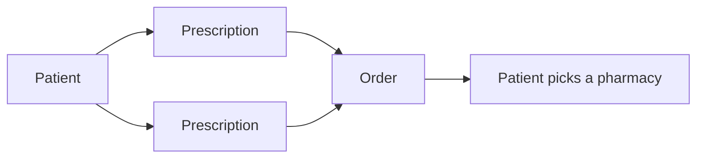

Photon has three records. Prescribe, GraphQL and MCP all work with the same three.

| Record | Id | What it is | Lifecycle |
| --- | --- | --- | --- |
| **Patient** | `pat_…` | Who the prescription is for: demographics, insurance, and clinical history (allergies, medications, diagnoses). | Found or added, then updated. |
| **Prescription** | `rx_…` | One drug for one patient: the treatment, instructions (the sig), dispense quantity and diagnoses. | A draft until a prescriber signs it. Once signed, it can't change. |
| **Order** | `ord_…` | One or more signed prescriptions for one patient, sent together. | `DRAFT`, then `SUBMITTED` when it's sent, or `CANCELED`. |

A **template** is a saved prescription your organization sets up, with the drug, sig and dispense filled in. Manage templates and find their ids in the dashboard under [Settings → Templates](https://app.neutron.health/settings/templates). Start a prescription from one by passing its `templateId`.

## The flow

<Steps>
  <Step title="Patient">
    Send what you know about the patient. Photon finds the matching record or adds a new one. Allergies, medications and diagnoses go on the patient so every prescription can be screened against them.
  </Step>
  <Step title="Prescription">
    Name a drug or start from a template. Photon resolves the drug to its catalog and screens it against the patient's record each time the draft changes.
  </Step>
  <Step title="Sign">
    A prescriber reviews the draft and signs it. The signature covers exactly what they saw, so any later change needs a new prescription.
  </Step>
  <Step title="Order">
    Put the signed prescriptions on an order and submit it. Photon texts the patient, who picks a pharmacy. You can also choose the pharmacy yourself, but you don't have to.
  </Step>
</Steps>

## Get, sync and update

Each record has one upsert. You call it in one of three ways, and they work the same for patients, prescriptions and orders:

| Call | You send | Photon |
| --- | --- | --- |
| **Get** | An id, and nothing else | Returns the record. Nothing changes. |
| **Sync** | Whatever you know, with or without an id | Finds, matches, creates or updates the record. Photon decides which. |
| **Update** | An id and the fields to change | Changes only those fields on that record. |

Prescribe, GraphQL and MCP all use the same three calls. A React component given an id runs a get. Given fields, it runs a sync. Given both, it runs an update.

## Photon makes the decisions

You don't need to reimplement prescribing rules. Send what you know, and Photon's service:

- matches patients and avoids duplicates
- resolves free-text drug, allergy and diagnosis names to catalog entries
- screens each prescription for drug, allergy and condition conflicts
- checks that an order can be sent: every prescription signed, all for one patient, and a phone number on file
- routes the order and lets the patient choose a pharmacy

Every response tells you what Photon did. It lists **applied** changes (saved) and **unapplied** changes (rejected, or waiting on a choice). When Photon isn't sure, such as when two patients could match or a drug name fits several products, it returns the options and doesn't guess. A person or your own rules pick one. See [Changes and choices](/network/changes).

## Don't rebuild prescribing

The prescriber's part of the flow (finding the patient, choosing the drug, reviewing screening, signing, sending) is already built in [Prescribe](/prescribe/overview). It takes one React component or one iframe, and it keeps up as Photon adds features. Spend your effort on what only your product knows:

| Who | Does what | With |
| --- | --- | --- |
| **Your backend** | Keeps patients in sync, and drafts prescriptions and orders from your own rules | [Network](/network/overview) (GraphQL) and a machine token |
| **An agent** | Takes intake, searches drugs and drafts prescriptions | [MCP](/network/mcp) |
| **The prescriber** | Reviews, signs and sends | [Prescribe](/prescribe/overview) and their own sign-in |
| **Photon** | Matching, drug resolution, screening, routing and pharmacy choice | Photon's service |

<Note>
  Only a signed-in prescriber can sign. Machine tokens can draft but can't sign prescriptions, so the last step always happens in a browser. See [Authentication](/authentication).
</Note>
