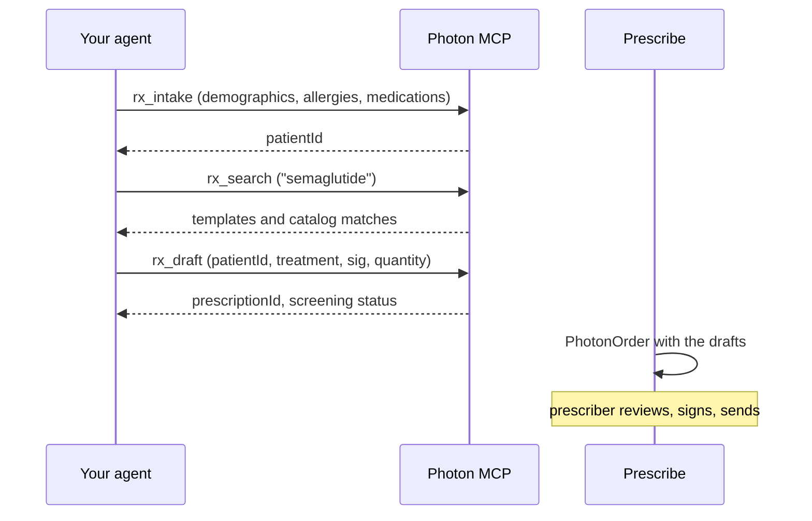

<Note>
  MCP is in **private preview**. To get access, ask your Photon contact.
</Note>

The most advanced integrations put an agent in front. It talks to the patient or reads the encounter, records what it learns on the patient, finds the right drug, and drafts the prescriptions. A prescriber then opens the drafts in Prescribe and signs and sends them.



## 1. Connect the agent

Point your agent's MCP client at the Neutron server:

```text
https://network.neutron.health/mcp
```

During the preview, the server runs at `https://ai.neutron.health`. {/* TODO(launch) */}⚠️ `network.neutron.health/mcp` isn't live yet, so use `ai.neutron.health` for now. The agent authenticates like any other caller. A backend agent uses a [machine token](/authentication#machine-tokens). An agent that runs in a prescriber's MCP client, such as Claude or ChatGPT, signs in as that prescriber. See [Connect a client](/network/mcp/connect).

## 2. Intake, search, draft

The agent calls three tools, in order:

| Tool | Does | Returns |
| --- | --- | --- |
| `rx_intake` | Finds or adds the patient and records allergies and medications, so drafts are screened against them | `patientId` |
| `rx_search` | Finds your organization's templates and catalog drugs by name and strength. It doesn't need a patient. | Options, each with a `treatment` |
| `rx_draft` | Drafts one unsigned prescription from a chosen `treatment`, which needs `instructions`, `dispenseQuantity` and `dispenseUnit`, and screens it | `prescriptionId` and `ready`, `warning` or `blocked` |

Each tool's inputs and outputs are in [Prescribing tools](/network/mcp/prescribing). Photon makes the decisions here as well. When it isn't sure which patient or drug is meant, the tool fails closed and tells the agent what to ask or send next. Agents should never invent ids, sigs or quantities.

If the agent learns something safety-relevant after drafting, such as a new allergy, it calls `rx_intake` again and redrafts.

## 3. Hand the drafts to a prescriber

Pass the patient and the draft prescriptions to Prescribe. The prescriber sees each draft with its screening, signs, and sends.

<CodeGroup>

```tsx React
<PhotonOrder
  order={{
    patient: { id: patientId },
    prescriptions: { add: draftIds.map((id) => ({ id })) },
  }}
  fixed
  onSent={onDone}
/>
```

```ts iframe
// ph = photon({ environment: "neutron", auth: { clientId: "YOUR_CLIENT_ID" } })
iframe.src = ph.order.frame({
  patient: { id: patientId },
  prescriptions: { add: draftIds.map((id) => ({ id })) },
});
```

</CodeGroup>

To hand over a single id instead, put the drafts on a draft order from your backend ([step 2 of One-click orders](/integrations/one-click-orders#2-put-the-prescriptions-on-an-order)) and open `order="ord_…"`.

## Sending from the agent

When the agent runs as the prescriber, it can send without Prescribe. `rx_send` takes the reviewed drafts and the prescriber's explicit confirmation, and Photon checks on the server that the token belongs to a prescriber. A machine token can't send. See [`rx_send`](/network/mcp/prescribing#rx_send).
