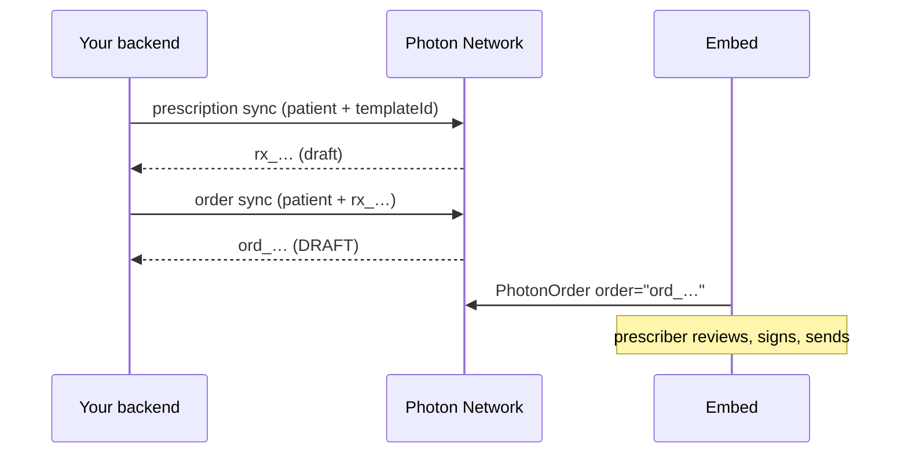

When your product already knows what should be prescribed (a protocol, a plan or a refill), your backend drafts the whole order. The prescriber opens it in Embed, already filled in, and only reviews, signs and sends.



Before you start, [sync the patient](/integrations/sync-patients) so you have their `pat_…` id, and look up the template ids for your organization.

## 1. Draft a prescription from each template

Use your own rules to choose the templates, then sync a prescription for each one. A template fills in the drug, sig and dispense, and Photon screens the draft against the patient's record.

```graphql
mutation DraftPrescription($prescription: PrescriptionInput!, $metadata: RequestMetadata!) {
  prescription(prescription: $prescription, metadata: $metadata) {
    __typename
    ... on PrescriptionPayload {
      prescription { id status treatment { name } }
      unappliedChanges { key status reason }
    }
    ... on AmbiguousPrescriptionMatch { reason candidates { id instructions } }
    ... on OperationError { code message }
  }
}
```

```json Variables
{
  "prescription": {
    "patient": { "id": "pat_01M3WQQHRB1T0K1469KD18BAWX" },
    "templateId": "YOUR_TEMPLATE_ID"
  },
  "metadata": { "source": "DIRECT_API", "client": "acme-ehr" }
}
```

The result is an unsigned draft, `rx_…`. Its `status` is `READY`, `WARNING` or `BLOCKED` based on [screening](/network/screening).

<Warning>
  Always send a `templateId` or a `treatment`. If the patient already has drafts in progress, Photon may continue one of them, or return `AmbiguousPrescriptionMatch` so you can say which by sending its `id`.
</Warning>

## 2. Put the prescriptions on an order

```graphql
mutation DraftOrder($order: OrderInput!, $metadata: RequestMetadata!) {
  order(order: $order, metadata: $metadata) {
    __typename
    ... on OrderPayload {
      order { id state prescriptions { id } }
      unappliedChanges { key status reason }
    }
    ... on AmbiguousOrderMatch { reason candidates { id prescriptionIds } }
    ... on OperationError { code message }
  }
}
```

```json Variables
{
  "order": {
    "patient": { "id": "pat_01M3WQQHRB1T0K1469KD18BAWX" },
    "prescriptions": { "add": [{ "id": "rx_01M3WT4NERS2YVQRF6YTWR4A6C" }, { "id": "rx_01M3WT515TQ3D1348GGS70MV1Z" }] }
  },
  "metadata": { "source": "DIRECT_API", "client": "acme-ehr" }
}
```

The order stays a `DRAFT`, and nothing goes to the patient yet. Store its `ord_…` id.

## 3. Open the order in Embed

<CodeGroup>

```tsx React
<PhotonProvider clientId="YOUR_CLIENT_ID" environment="neutron">
  <PhotonOrder order="ord_01M3WT5GK51DBRH7ZKBKBV9QWK" onSent={onDone} />
</PhotonProvider>
```

```html iframe
<iframe src="https://rx.neutron.health/order/embed/ord_01M3WT5GK51DBRH7ZKBKBV9QWK" title="Prescribe" style="width: 100%; border: 0"></iframe>
```

</CodeGroup>

The prescriber sees the patient and each prescription, with screening alerts. They can adjust a draft, then sign each prescription and click **Send**.

## Without a backend

If your frontend already knows the templates, skip steps 1 and 2. Pass the templates in the order and Embed drafts the prescriptions itself:

```tsx
<PhotonOrder
  order={{
    patient: { id: "pat_01M3WQQHRB1T0K1469KD18BAWX" },
    prescriptions: { add: [{ templateId: "YOUR_TEMPLATE_ID" }] },
  }}
/>
```

**Add another prescription** starts from the same template as the order's first line.
