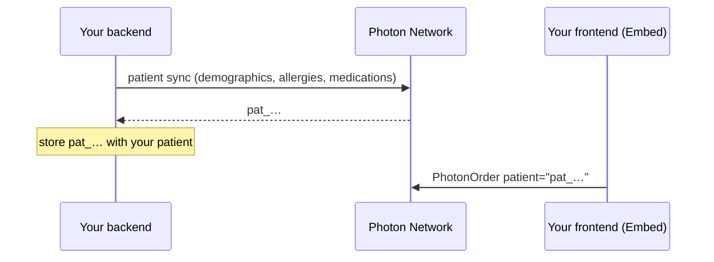

Screening is only as good as the patient record. When your backend sends each patient's allergies, medications and diagnoses to Photon, every prescription is checked against them. The prescriber also starts with the right patient instead of searching.

Your backend syncs with a [machine token](/authentication#machine-tokens), and your frontend opens Embed with the Photon id.



## 1. Sync the patient

Send everything you know. Photon matches an existing patient or adds a new one, then applies the clinical updates.

<CodeGroup>

```ts Node.js
const SYNC_PATIENT = `
  mutation SyncPatient($patient: PatientInput!, $metadata: RequestMetadata!) {
    patient(patient: $patient, metadata: $metadata) {
      __typename
      ... on PatientPayload {
        patient { ... on Patient { id } }
        unappliedChanges { key status reason }
      }
      ... on AmbiguousPatientMatch { reason candidates { id firstName lastName dateOfBirth } }
      ... on OperationError { code message }
    }
  }`;

const result = await photonGraphQL(SYNC_PATIENT, {
  patient: {
    id: ourPatient.photonId ?? undefined, // once you have it
    demographic: {
      name: { first: "Paige", last: "Turner" },
      dateOfBirth: "1990-01-01",
      sex: "FEMALE",
      phone: "+13175550142",
      email: "paige@example.com",
    },
    clinical: {
      allergies: { add: [{ rxNormId: "723" }] }, // amoxicillin
      medications: { add: [{ name: "lisinopril 10 mg oral tablet", status: "ACTIVE" }] },
    },
  },
  metadata: { source: "DIRECT_API", client: "acme-ehr" },
});
```

```ts photonGraphQL.ts
// A minimal client: one cached machine token, one POST per call.
let token: { value: string; expiresAt: number } | null = null;

async function machineToken() {
  if (token && Date.now() < token.expiresAt - 60_000) return token.value;
  const res = await fetch("https://auth.neutron.health/oauth/token", {
    method: "POST",
    headers: { "Content-Type": "application/json" },
    body: JSON.stringify({
      client_id: process.env.PHOTON_CLIENT_ID,
      client_secret: process.env.PHOTON_CLIENT_SECRET,
      audience: "https://api.neutron.health",
      grant_type: "client_credentials",
    }),
  });
  const { access_token, expires_in } = await res.json();
  token = { value: access_token, expiresAt: Date.now() + expires_in * 1000 };
  return token.value;
}

export async function photonGraphQL(query: string, variables: object) {
  const res = await fetch("https://network.neutron.health/graphql", {
    method: "POST",
    headers: { Authorization: `Bearer ${await machineToken()}`, "Content-Type": "application/json" },
    body: JSON.stringify({ query, variables }),
  });
  const { data, errors } = await res.json();
  if (errors) throw new Error(errors[0].message); // bad token or bad query
  return Object.values(data)[0] as any; // the mutation's result
}
```

</CodeGroup>

## 2. Handle the result

```ts
switch (result.__typename) {
  case "PatientPayload":
    if (result.patient?.id) await savePhotonId(ourPatient.id, result.patient.id);
    // anything Photon couldn't apply, such as an allergy name that matched several products
    for (const change of result.unappliedChanges) log(change.key, change.status, change.reason);
    break;
  case "AmbiguousPatientMatch":
    // Photon isn't sure which patient this is. Don't guess: leave it unlinked and
    // let the prescriber pick in Embed, or match one of result.candidates yourself.
    break;
  default:
    // UnauthorizedError or UpstreamServiceError (retry if retryable)
    throw new Error(`${result.code}: ${result.message}`);
}
```

<Tip>
  Identify allergies and medications by `rxNormId` when you have it. Names are resolved too, but a name that fits several products comes back as a choice rather than being applied. See [Changes and choices](/network/changes).
</Tip>

## 3. Keep it current

Sync whenever the patient changes in your system, such as a new allergy, a new medication or a new phone number. Once you have the Photon id, always send it with your sync, and Photon updates that patient.

| To | Send |
| --- | --- |
| Add an allergy | `clinical: { allergies: { add: [{ rxNormId: "723" }] } }` |
| Remove one | `clinical: { allergies: { remove: [{ id: "alg_…" }] } }` |
| Record no known allergies | `clinical: { allergies: { none: true } }` |
| Stop a medication | `clinical: { medications: { update: [{ rxNormId: "314076", status: "HISTORICAL" }] } }` |
| Change contact details | `demographic: { phone: "+13175550199" }` |

Leave out a field to keep it as it is.

## 4. Open Embed by id

```tsx
<PhotonOrder patient={ourPatient.photonId} fixed onSent={onDone} />
```

The prescriber lands on the right patient with their history already on file.

## Next

- [One-click orders](/integrations/one-click-orders): have your backend draft the order too.
- [Patient reference](/network/patient): every field, and how matching works.
