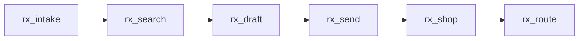

<Note>
  MCP is in **private preview**. These pages describe the tools as they are today, and they'll change as MCP moves onto the rebuilt Network API. To talk through your use case, ask your Photon contact.
</Note>

Photon's MCP server gives an AI assistant or agent a few prescribing tools. A clinician can prescribe from Claude or ChatGPT, and your own agent can take intake and draft prescriptions for a prescriber to send.

> Prescribe amlodipine 5 mg daily for Paige Turner, born 1990-01-01.

From a request like that, the agent finds the patient, finds the medication, drafts the prescription, shows the screening results, and sends once the prescriber confirms.

<Frame>
  <iframe src="https://www.loom.com/embed/8216d63e7d15431cb725593c893e7327" width="100%" height="400" frameBorder="0" allowFullScreen />
</Frame>

## The flow

| Tool | Does | Page |
| --- | --- | --- |
| `rx_intake` | Finds or adds the patient and records allergies and medications | [Prescribing](/network/mcp/prescribing#rx_intake) |
| `rx_search` | Finds templates and medications by name | [Prescribing](/network/mcp/prescribing#rx_search) |
| `rx_draft` | Drafts one prescription and screens it | [Prescribing](/network/mcp/prescribing#rx_draft) |
| `rx_send` | Sends reviewed drafts after the prescriber confirms | [Prescribing](/network/mcp/prescribing#rx_send) |
| `rx_shop` | Reads an order's status, offers and nearby pharmacies | [Fulfillment](/network/mcp/fulfillment#rx_shop) |
| `rx_route` | Sends an order to the chosen pharmacy | [Fulfillment](/network/mcp/fulfillment#rx_route) |

## Server

| Environment | URL |
| --- | --- |
| Neutron | `https://ai.neutron.health` |
| Photon | `https://ai.photon.health` |

{/* TODO(launch): switch to network.<env>.health/mcp once MCP moves. */}

⚠️ MCP is moving to `https://network.neutron.health/mcp` (and `network.photon.health/mcp`). Until then, use the URLs above.

The server speaks MCP over streamable HTTP and supports OAuth discovery. See [Connect a client](/network/mcp/connect).

## Who's calling

| Token | From | Can |
| --- | --- | --- |
| A prescriber's sign-in | Claude or ChatGPT, added as a custom connector. Other clients, such as a scribe, must be allowlisted on your Application credential. | Every tool, including `rx_send` |
| A [machine token](/authentication#machine-tokens) | Your backend agent | Intake, search and draft. It can't send, so a prescriber sends from [Prescribe](/prescribe/overview). |

The server passes your token to Photon's API, and the API enforces what it can do. Agents shouldn't ask a prescriber to prove they're authorized, or refuse to send because a send transmits a prescription. Photon makes that check.

## Rules for agents

- **Photon decides.** When a patient or drug is ambiguous, the tool fails closed and says what to ask next. Never invent ids, instructions, quantities or units.
- **The agent holds the conversation.** The server keeps no state between calls. Records live in Photon, and the agent passes `patientId` and the draft fields from one call to the next.
- **The prescriber sends.** The agent drafts. Only the prescriber's explicit confirmation sends, either with `rx_send` or in [Prescribe](/prescribe/overview).
- **Don't ask for a pharmacy or address before sending.** The patient chooses a pharmacy after the order exists. Use `rx_shop` and `rx_route` if you need to route it.
- **Neutron never sends real prescriptions.** In the sandbox, `rx_send` creates test orders only.
